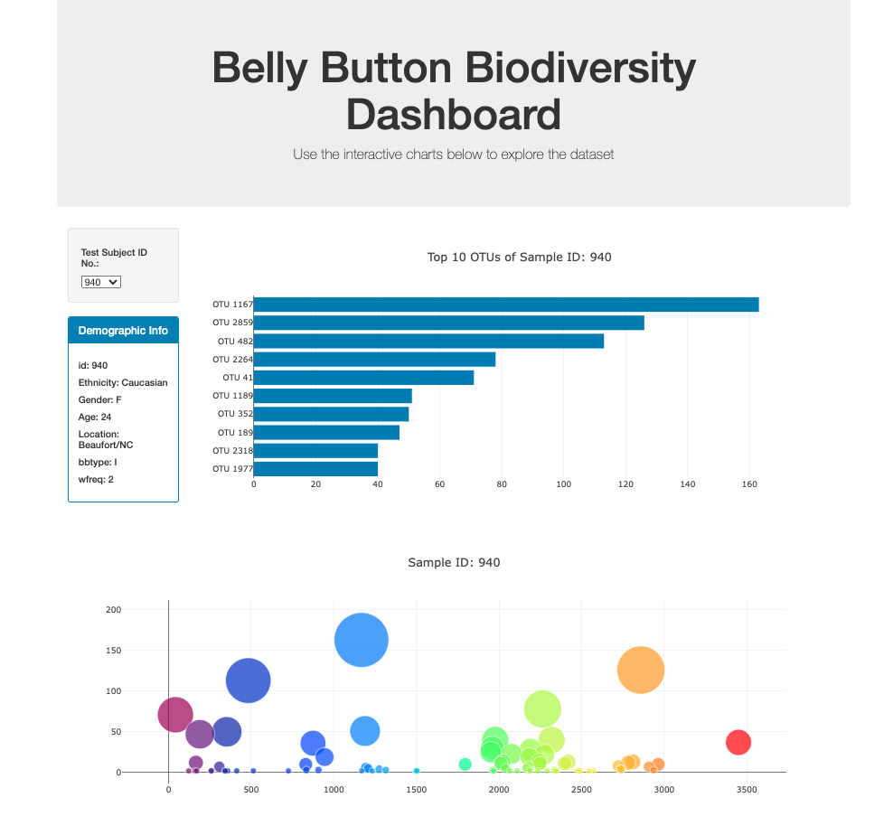
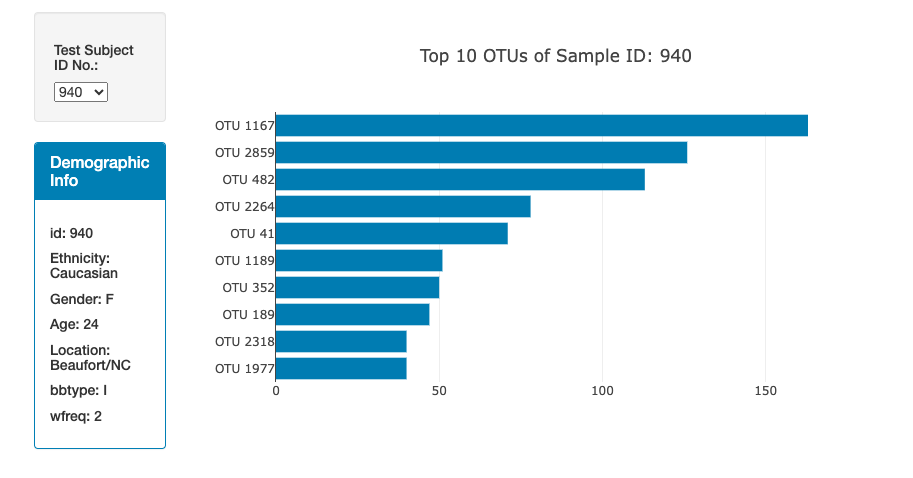
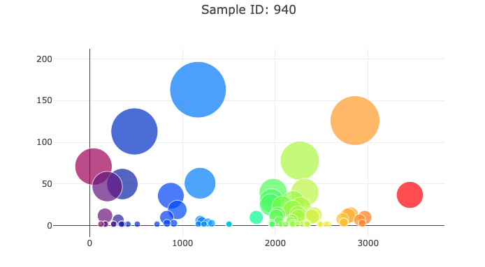

# belly-button-challenge
belly-button-challenge is an exercise to practice create data dashboards with html and javascript. 

To practice these skills, the script aims to produce two dynamic visualizations using data of belly button bacterial diversity. The visualizations change via dropdown to select which sample you want to visualize and displays metadata relating to that sample.

</img>

### Bar Chart
---
The bar chart displays the top ten OTU ids with the highest diversity within the sample. You can select which test subect ID you are viewing via the drop down on the right.

</img>

### Bubble Chart
---
The bubble chart displays the biodiversity for all the OTU IDs. The bubble vary in color based on the OTU id and size based on the biodiveristy. You can select which test subect ID you are viewing via the drop down on the right.

</img>

---
Script was made for UCB Data Analytics Challenge 14

Author - Jacob Pohs
